# Property Rental App

- [About](#about)
- [Getting Started](#getting-started)
  - [Prerequisites](#prerequisites)
  - [Installation](#installation)
  - [Usage](#usage)
  - [Build](#usage)
- [Screenshots](#screenshots)

## About

This is a React Native app that allows users to explore and find properties to rent. It was built using Expo and TypeScript.

The app uses a fake API server to fetch data and serves no real purpose other than to showcase my skills as a developer and improve my portfolio.

## Getting Started

### Prerequisites

- Node.js: [Download](https://nodejs.org/)
- Expo CLI (Only if you want to build the project): Install globally using `npm install --global eas-cli`

### Installation

1. Clone the repository:

   ```bash
   git clonegit@github.com:henriquemod/property-rental-app.git
    ```

2. Navigate to the project directory:

   ```bash
   cd property-rental-app
   ```

3. Install dependencies:

   ```bash
   npm install
   ```
  
4. Create a `.env` file in the root directory of the project and add the following:

   ```bash
   ENV=development #or production
   ENDPOINT=http://localhost:3000 #your api endpoint
   ```

### Usage

First start the fake API server:

```bash
npm run fake:backend
```

Then start the Expo server:

```bash
npm start
```

### Build

To build the project, run:

```bash
npm run android-build #Development build for Android
npm run android-build-prod #Production build for Android

npm run ios-build #Development build for iOS
npm run ios-build-prod #Production build for iOS
```

## Screenshots

<div style="display: flex; flex-direction: row; justify-content: center">
<h3 style="margin-right: 30px">Auth</h3>
</div>
<div style="display: flex; flex-direction: row; justify-content: center; gap: 30px">
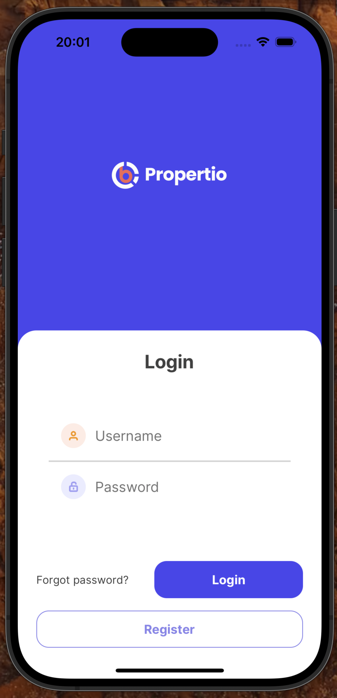
  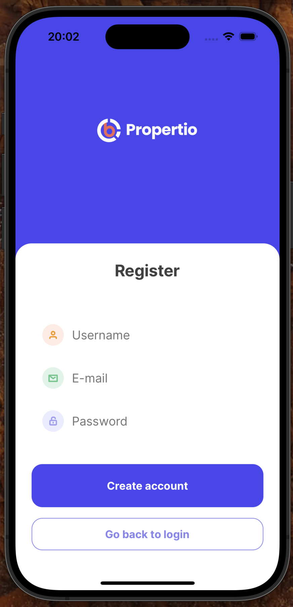
</div>

<div style="display: flex; flex-direction: row; justify-content: center">
<h3 style="margin-right: 30px">Home</h3>
</div>
<div style="display: flex; flex-direction: row; justify-content: center; gap: 30px">
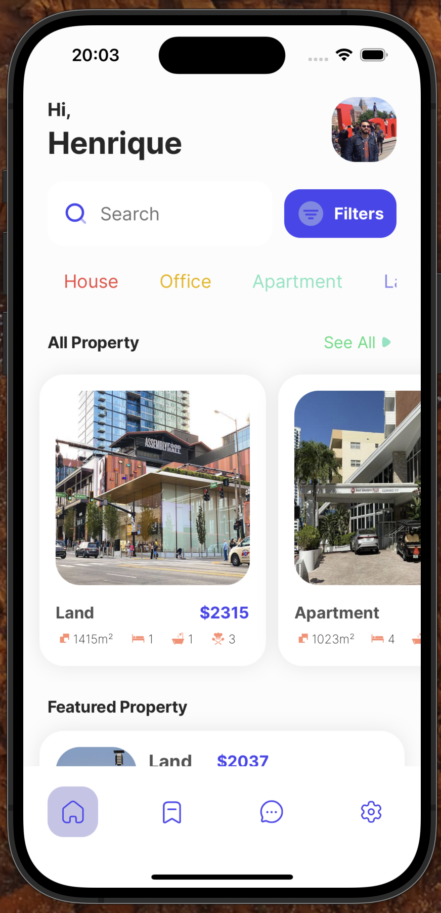
  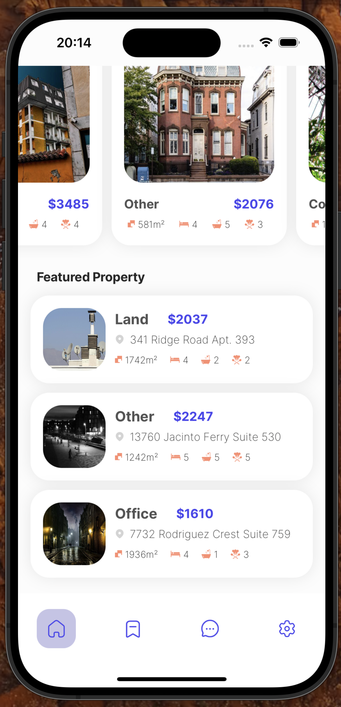
</div>

<div style="display: flex; flex-direction: row; justify-content: center">
<h3 style="margin-right: 30px">Property Details</h3>
</div>

<div style="display: flex; flex-direction: row; justify-content: center; gap: 30px; margin-bottom: 30px">
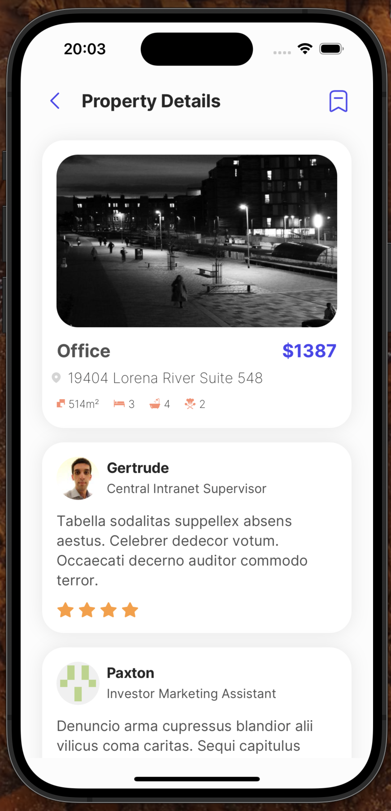
  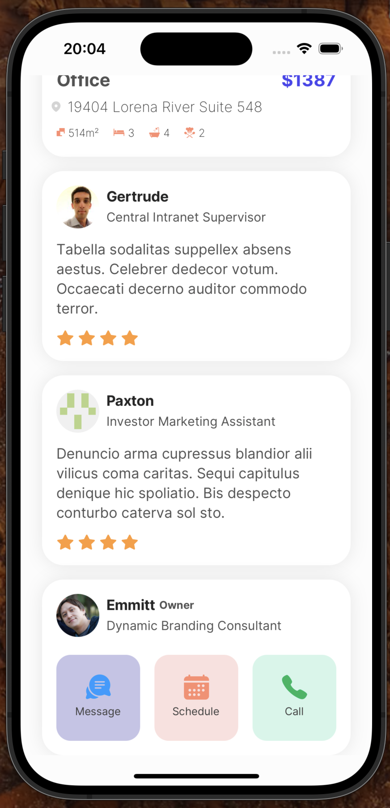
</div>

<div style="display: flex; flex-direction: row; justify-content: center; gap: 30px">

  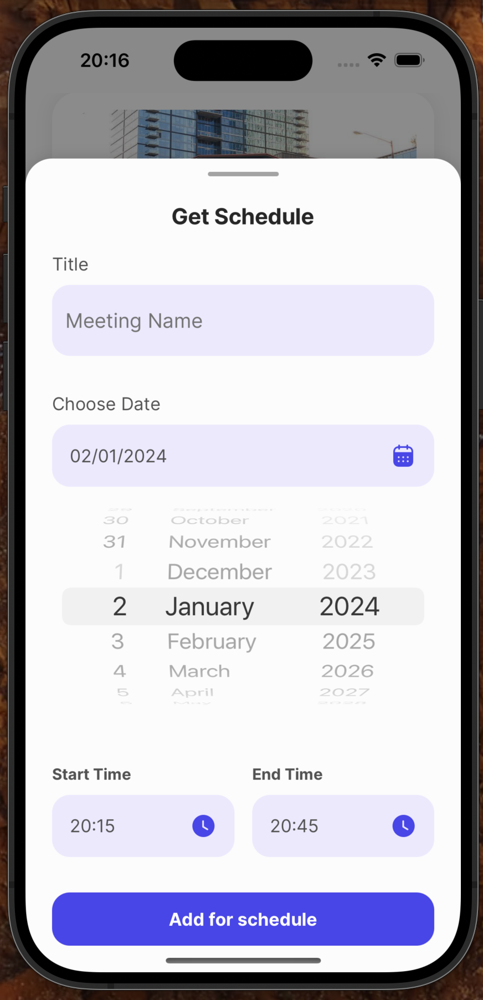
</div>

<div style="display: flex; flex-direction: row; justify-content: center">
<h3 style="margin-right: 30px">Messages</h3>
</div>

<div style="display: flex; flex-direction: row; justify-content: center; gap: 30px">
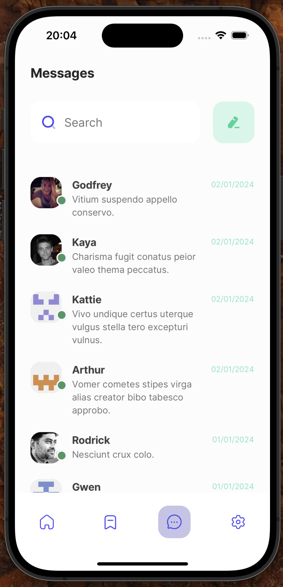
  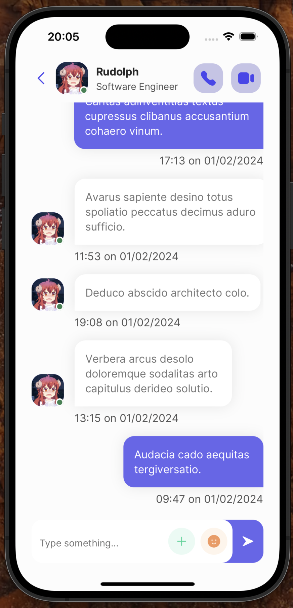
</div>

<div style="display: flex; flex-direction: row; justify-content: center">
<h3 style="margin-right: 30px">Others</h3>
</div>

<div style="display: flex; flex-direction: row; justify-content: center; gap: 30px">
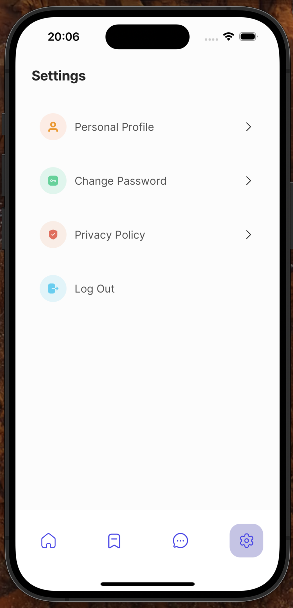
  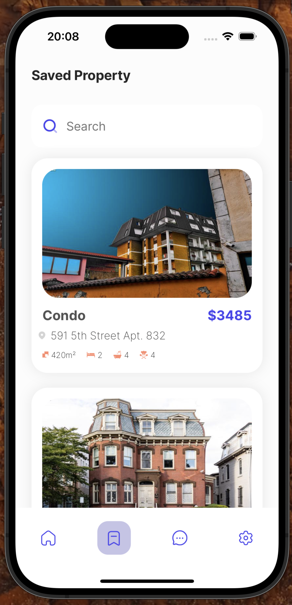
</div>
